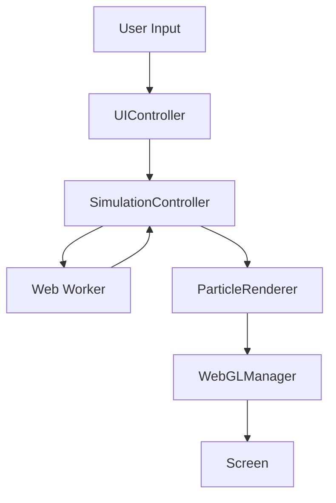

# Cosmic Lottery Architecture

## Overview

Cosmic Lottery is built on a modular architecture that separates concerns between rendering, physics simulation, UI management, and core game logic. The application uses modern web technologies and follows best practices for performance and maintainability.

## Core Components

### WebGLManager
- Handles WebGL context and Three.js scene management
- Manages camera controls and viewport sizing
- Implements context loss/restoration handling
- Controls render loop timing

### SimulationController
- Manages particle physics simulation state
- Coordinates with Web Worker for physics calculations
- Controls animation phases and transitions
- Handles particle selection and updates

### ParticleRenderer
- Manages particle geometry and materials
- Implements custom shaders for particle effects
- Handles particle instancing and batching
- Controls particle visual states and animations

### UIController
- Manages user interface elements and interactions
- Handles input validation and feedback
- Controls animation progress display
- Manages message box and loading states

### i18n System
- Provides language switching capabilities
- Manages translation loading and updates
- Handles dynamic text content updates
- Supports multiple locales

## Communication Flow

## State Management

### Simulation States
1. FLOATING - Initial particle state
2. SWIRLING - Pre-selection animation
3. BLACKHOLE - Particle convergence
4. CLASHING - Selection point
5. LINING_UP - Final number display

### WebGL Context States
- Active
- Lost
- Restored
- Disposed

## Performance Considerations

### Rendering Optimizations
- Use of instanced rendering
- Batched geometry updates
- Shader-based animations
- Texture atlasing for particles

### Physics Optimizations
- Web Worker offloading
- Spatial partitioning
- Batch physics updates
- Optimized collision detection

### Memory Management
- Proper resource cleanup
- Texture pooling
- Geometry reuse
- Event listener cleanup

## Error Handling

### WebGL Context Loss
1. Save current state
2. Clean up resources
3. Wait for context restoration
4. Reinitialize components
5. Restore saved state

### Physics Engine Errors
1. Attempt worker restart
2. Roll back to safe state
3. Notify user if needed
4. Log error details

## Future Improvements

### Planned Features
- [ ] Multiple visualization modes
- [ ] Advanced particle effects
- [ ] Sound effects and music
- [ ] More language support
- [ ] Performance profiling tools

### Technical Debt
- Implement proper typing (TypeScript)
- Add unit tests
- Improve documentation
- Add performance monitoring
- Implement error boundaries
